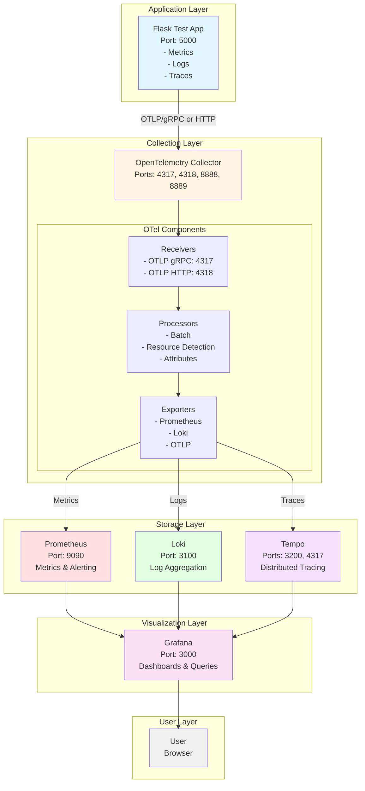
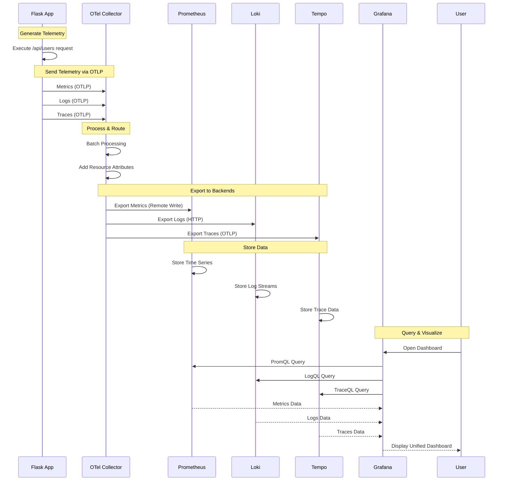
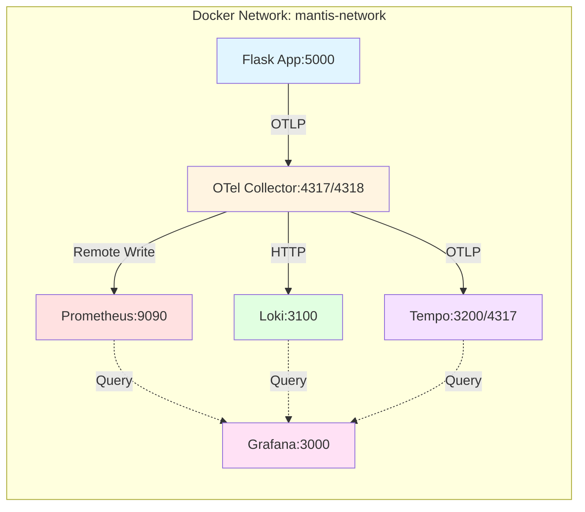
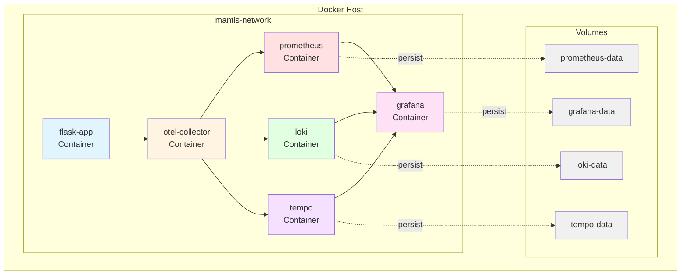
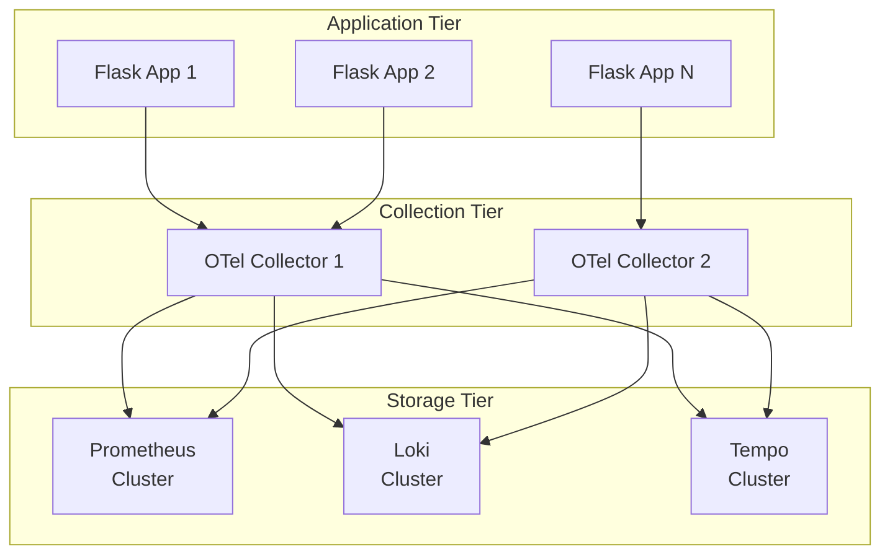
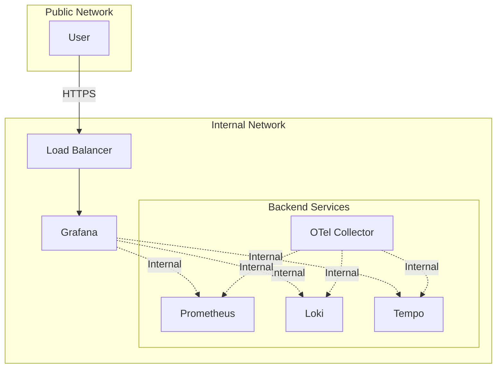

# Mantis Architecture

This document provides detailed architectural diagrams for the Mantis observability platform.

## Table of Contents

- [High-Level Architecture](#high-level-architecture)
- [ASCII Diagram](#ascii-diagram)
- [Mermaid Component Diagram](#mermaid-component-diagram)
- [Sequence Diagram](#sequence-diagram)
- [Network & Ports](#network--ports)
- [Component Details](#component-details)

## High-Level Architecture

Mantis is built on the LGTM stack (Loki, Grafana, Tempo, Prometheus) with OpenTelemetry Collector as the central telemetry collection and routing layer.

### Key Principles

1. **Single Protocol**: All telemetry uses OTLP (OpenTelemetry Protocol)
2. **Centralized Collection**: OTel Collector as the single entry point
3. **Vendor Agnostic**: Easy to swap backend systems
4. **Auto-Correlation**: Automatic correlation of metrics, logs, and traces

## ASCII Diagram

```
┌─────────────────────────────────────────────────────────────────────────────┐
│                         MANTIS OBSERVABILITY STACK                          │
│                        (LGTM + OpenTelemetry Collector)                     │
└─────────────────────────────────────────────────────────────────────────────┘

┌──────────────────┐
│   Flask Test App │
│  (Port: 5000)    │
│                  │
│  - Metrics       │
│  - Logs          │
│  - Traces        │
└────────┬─────────┘
         │
         │ OTLP/gRPC or OTLP/HTTP
         │ (Port: 4317/4318)
         │
         ▼
┌────────────────────────────────────────────┐
│   OpenTelemetry Collector                  │
│   (Port: 4317, 4318, 8888, 8889)          │
│                                            │
│  ┌──────────────────────────────────────┐ │
│  │          RECEIVERS                   │ │
│  │  - OTLP (gRPC: 4317, HTTP: 4318)    │ │
│  └──────────────────────────────────────┘ │
│                    │                       │
│                    ▼                       │
│  ┌──────────────────────────────────────┐ │
│  │         PROCESSORS                   │ │
│  │  - Batch                             │ │
│  │  - Resource Detection                │ │
│  │  - Attributes                        │ │
│  └──────────────────────────────────────┘ │
│                    │                       │
│         ┌──────────┴──────────┐           │
│         ▼          ▼          ▼           │
│  ┌──────────┐ ┌────────┐ ┌─────────┐     │
│  │ Metrics  │ │  Logs  │ │ Traces  │     │
│  │ Pipeline │ │Pipeline│ │ Pipeline│     │
│  └──────────┘ └────────┘ └─────────┘     │
│         │          │          │           │
│         ▼          ▼          ▼           │
│  ┌──────────────────────────────────────┐ │
│  │          EXPORTERS                   │ │
│  │  - Prometheus (Remote Write/Scrape) │ │
│  │  - Loki (HTTP Push)                  │ │
│  │  - OTLP (for Tempo)                  │ │
│  └──────────────────────────────────────┘ │
└──────┬─────────────┬─────────────┬────────┘
       │             │             │
       │             │             │
       ▼             ▼             ▼
┌────────────┐ ┌───────────┐ ┌──────────┐
│ Prometheus │ │   Loki    │ │  Tempo   │
│ (Port:9090)│ │(Port:3100)│ │(Port:3200│
│            │ │           │ │  & 4317) │
│ - Metrics  │ │ - Logs    │ │ - Traces │
│ - Alerting │ │ - Queries │ │ - Queries│
└────────────┘ └───────────┘ └──────────┘
       │             │             │
       │             │             │
       └─────────────┼─────────────┘
                     │
                     ▼
              ┌─────────────┐
              │   Grafana   │
              │ (Port: 3000)│
              │             │
              │ Datasources:│
              │ - Prometheus│
              │ - Loki      │
              │ - Tempo     │
              │             │
              │ Dashboards: │
              │ - Metrics   │
              │ - Logs      │
              │ - Traces    │
              │ - Unified   │
              └─────────────┘
                     │
                     ▼
              ┌─────────────┐
              │    User     │
              │  (Browser)  │
              └─────────────┘

Legend:
  → Data Flow
  ┌─┐ Component
  │ │ Service
  └─┘
```

## Mermaid Component Diagram



## Sequence Diagram

This diagram shows the flow of a single request through the entire observability stack.



## Network & Ports

### Port Mapping

| Component | Port(s) | Protocol | Purpose |
|-----------|---------|----------|---------|
| Flask App | 5000 | HTTP | Application endpoints |
| OTel Collector | 4317 | gRPC | OTLP receiver (gRPC) |
| OTel Collector | 4318 | HTTP | OTLP receiver (HTTP) |
| OTel Collector | 8888 | HTTP | Prometheus metrics (self-monitoring) |
| OTel Collector | 8889 | HTTP | Health check endpoint |
| Prometheus | 9090 | HTTP | Metrics query & UI |
| Loki | 3100 | HTTP | Log ingestion & query |
| Tempo | 3200 | HTTP | Tempo query frontend |
| Tempo | 4317 | gRPC | OTLP receiver |
| Grafana | 3000 | HTTP | Web UI & API |

### Network Communication



## Component Details

### 1. Flask Test Application

**Purpose**: Generate sample telemetry data for testing the observability stack.

**Technologies**:
- Flask web framework
- OpenTelemetry SDK (Python)
- OTLP exporters

**Responsibilities**:
- Handle HTTP requests
- Generate metrics (counters, gauges, histograms)
- Emit structured logs
- Create traces with spans
- Export all telemetry to OTel Collector via OTLP

### 2. OpenTelemetry Collector

**Purpose**: Central telemetry collection, processing, and routing.

**Configuration Components**:

#### Receivers
- **OTLP gRPC** (port 4317): Receives telemetry from applications
- **OTLP HTTP** (port 4318): Alternative HTTP endpoint for OTLP

#### Processors
- **Batch**: Batches telemetry for efficient export
- **Resource Detection**: Adds environment metadata
- **Attributes**: Adds/modifies telemetry attributes

#### Exporters
- **Prometheus**: Exports metrics (Remote Write or scrape endpoint)
- **Loki**: Exports logs via HTTP
- **OTLP**: Exports traces to Tempo

**Benefits**:
- Decouples applications from backend systems
- Provides data transformation and enrichment
- Offers retry and buffering capabilities
- Enables multi-backend support

### 3. Prometheus

**Purpose**: Time-series metrics storage and querying.

**Responsibilities**:
- Receive metrics from OTel Collector
- Store time-series data
- Provide PromQL query interface
- Alert evaluation (optional)

**Data Model**:
- Metrics with labels
- Time-series data points
- Scrape-based or push-based collection

### 4. Loki

**Purpose**: Log aggregation and querying.

**Responsibilities**:
- Receive logs from OTel Collector
- Index and store log streams
- Provide LogQL query interface
- Efficient log storage with compression

**Data Model**:
- Log streams with labels
- Log entries with timestamps
- Label-based indexing

### 5. Tempo

**Purpose**: Distributed tracing backend.

**Responsibilities**:
- Receive traces from OTel Collector
- Store trace data
- Provide TraceQL query interface
- Link traces to metrics and logs

**Data Model**:
- Traces (collection of spans)
- Spans (individual operations)
- Trace context propagation

### 6. Grafana

**Purpose**: Visualization and dashboard platform.

**Responsibilities**:
- Query Prometheus, Loki, and Tempo
- Display metrics, logs, and traces
- Provide unified observability dashboards
- Enable correlation between signals

**Features**:
- Pre-configured datasources
- Custom dashboards
- Alerting (optional)
- Explore interface

## Data Flow Patterns

### 1. Metrics Flow

```
Flask App → [Generate Metrics]
         → [Export via OTLP]
         → OTel Collector
         → [Batch & Process]
         → [Prometheus Exporter]
         → Prometheus
         → [Store Time Series]
         → Grafana [Query with PromQL]
```

### 2. Logs Flow

```
Flask App → [Generate Logs]
         → [Export via OTLP]
         → OTel Collector
         → [Batch & Process]
         → [Loki Exporter]
         → Loki
         → [Store Log Streams]
         → Grafana [Query with LogQL]
```

### 3. Traces Flow

```
Flask App → [Generate Spans]
         → [Export via OTLP]
         → OTel Collector
         → [Batch & Process]
         → [OTLP Exporter]
         → Tempo
         → [Store Traces]
         → Grafana [Query with TraceQL]
```

### 4. Correlation Flow

```
User Request → Flask App → Generate trace_id
                        → Attach trace_id to logs
                        → Attach trace_id to metrics

In Grafana → View Trace
          → Click "View Logs"
          → See logs with same trace_id
          → Click "View Metrics"
          → See metrics from same timeframe
```

## Deployment Architecture

### Docker Compose Setup



## Scalability Considerations

### Horizontal Scaling



**Scaling Points**:
1. **Applications**: Add more Flask app instances
2. **OTel Collectors**: Deploy multiple collectors for load distribution
3. **Storage**: Use clustered modes for Prometheus, Loki, and Tempo
4. **Grafana**: Deploy multiple Grafana instances behind load balancer

## Security Considerations

### Network Security



**Security Layers**:
1. **Network Isolation**: Internal services not exposed to public
2. **Authentication**: Grafana login required
3. **TLS/HTTPS**: Encrypted communication
4. **Secrets Management**: Credentials in environment variables
5. **Least Privilege**: Service accounts with minimal permissions

## Monitoring the Monitoring Stack

### Self-Observability

The OTel Collector itself exposes metrics about its operation:

```mermaid
graph LR
    OTel[OTel Collector] -->|Exposes Metrics| OTelMetrics[/metrics endpoint]
    OTelMetrics -->|Scraped by| Prom[Prometheus]
    Prom --> Grafana[Grafana Dashboard:<br/>OTel Collector Health]
```

**Key Metrics**:
- `otelcol_receiver_accepted_metric_points`
- `otelcol_receiver_refused_metric_points`
- `otelcol_exporter_sent_metric_points`
- `otelcol_exporter_send_failed_metric_points`

This enables monitoring the health of the monitoring stack itself.
