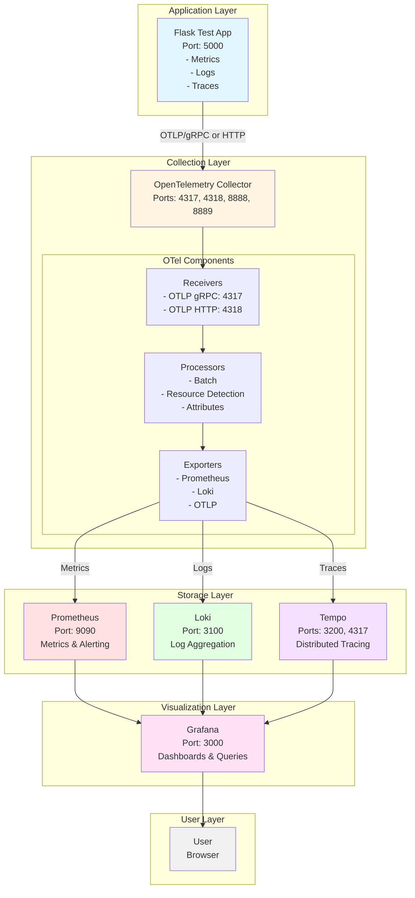
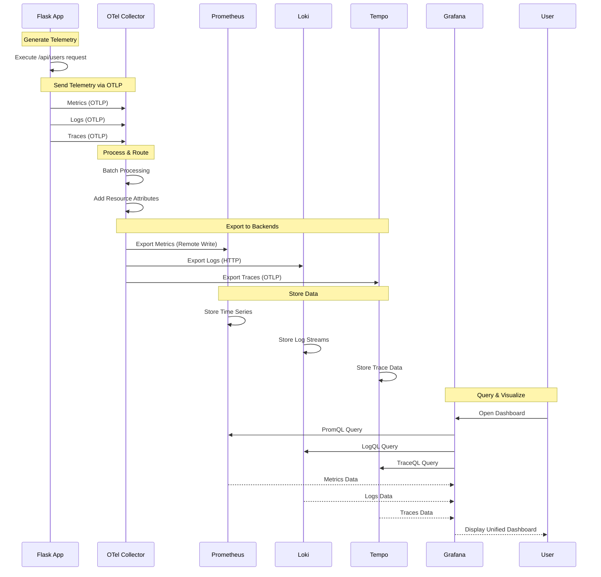

# LGTM Stack Implementation Plan

## Overview

This document outlines the implementation plan for the Mantis observability platform based on the LGTM stack (Loki, Grafana, Tempo, Prometheus). The implementation includes a unified Flask test application for generating metrics, logs, and traces.

## Architecture Overview

### Core LGTM Stack Components

1. **OpenTelemetry Collector** - Unified telemetry collection, processing, and routing
2. **Loki** - Log aggregation and querying
3. **Grafana** - Visualization dashboards
4. **Tempo** - Distributed tracing
5. **Prometheus** - Metrics collection and alerting

### Data Flow Architecture

#### ASCII Diagram

```
┌─────────────────────────────────────────────────────────────────────────────┐
│                         MANTIS OBSERVABILITY STACK                          │
│                        (LGTM + OpenTelemetry Collector)                     │
└─────────────────────────────────────────────────────────────────────────────┘

┌──────────────────┐
│   Flask Test App │
│  (Port: 5000)    │
│                  │
│  - Metrics       │
│  - Logs          │
│  - Traces        │
└────────┬─────────┘
         │
         │ OTLP/gRPC or OTLP/HTTP
         │ (Port: 4317/4318)
         │
         ▼
┌────────────────────────────────────────────┐
│   OpenTelemetry Collector                  │
│   (Port: 4317, 4318, 8888, 8889)          │
│                                            │
│  ┌──────────────────────────────────────┐ │
│  │          RECEIVERS                   │ │
│  │  - OTLP (gRPC: 4317, HTTP: 4318)    │ │
│  └──────────────────────────────────────┘ │
│                    │                       │
│                    ▼                       │
│  ┌──────────────────────────────────────┐ │
│  │         PROCESSORS                   │ │
│  │  - Batch                             │ │
│  │  - Resource Detection                │ │
│  │  - Attributes                        │ │
│  └──────────────────────────────────────┘ │
│                    │                       │
│         ┌──────────┴──────────┐           │
│         ▼          ▼          ▼           │
│  ┌──────────┐ ┌────────┐ ┌─────────┐     │
│  │ Metrics  │ │  Logs  │ │ Traces  │     │
│  │ Pipeline │ │Pipeline│ │ Pipeline│     │
│  └──────────┘ └────────┘ └─────────┘     │
│         │          │          │           │
│         ▼          ▼          ▼           │
│  ┌──────────────────────────────────────┐ │
│  │          EXPORTERS                   │ │
│  │  - Prometheus (Remote Write/Scrape) │ │
│  │  - Loki (HTTP Push)                  │ │
│  │  - OTLP (for Tempo)                  │ │
│  └──────────────────────────────────────┘ │
└──────┬─────────────┬─────────────┬────────┘
       │             │             │
       │             │             │
       ▼             ▼             ▼
┌────────────┐ ┌───────────┐ ┌──────────┐
│ Prometheus │ │   Loki    │ │  Tempo   │
│ (Port:9090)│ │(Port:3100)│ │(Port:3200│
│            │ │           │ │  & 4317) │
│ - Metrics  │ │ - Logs    │ │ - Traces │
│ - Alerting │ │ - Queries │ │ - Queries│
└────────────┘ └───────────┘ └──────────┘
       │             │             │
       │             │             │
       └─────────────┼─────────────┘
                     │
                     ▼
              ┌─────────────┐
              │   Grafana   │
              │ (Port: 3000)│
              │             │
              │ Datasources:│
              │ - Prometheus│
              │ - Loki      │
              │ - Tempo     │
              │             │
              │ Dashboards: │
              │ - Metrics   │
              │ - Logs      │
              │ - Traces    │
              │ - Unified   │
              └─────────────┘
                     │
                     ▼
              ┌─────────────┐
              │    User     │
              │  (Browser)  │
              └─────────────┘

Legend:
  → Data Flow
  ┌─┐ Component
  │ │ Service
  └─┘
```

#### Mermaid Diagram



#### Detailed Component Interaction



### Unified Flask Test Application

Single Flask app that generates all three telemetry types and sends them to OpenTelemetry Collector:

- **Metrics** - Application metrics sent via OTLP to OTel Collector
- **Logs** - Structured logs sent via OTLP to OTel Collector
- **Traces** - Distributed traces sent via OTLP to OTel Collector

The OTel Collector then routes:

- Metrics → Prometheus (via Remote Write or scraped metrics endpoint)
- Logs → Loki (via Loki exporter)
- Traces → Tempo (via OTLP exporter)

## Detailed Implementation Plan

### Phase 1: Infrastructure Setup

#### 1. Docker Compose Configuration

- Multi-service compose file with OTel Collector, Loki, Grafana, Tempo, and Prometheus
- Volume mounts for persistence
- Network configuration for service communication
- Health checks for all services
- Environment variable configuration

#### 2. OpenTelemetry Collector Configuration

- **Receivers**:
  - OTLP receiver (HTTP and gRPC) for metrics, logs, and traces
  - Prometheus receiver (optional, for scraping `/metrics` endpoints)
- **Processors**:
  - Batch processor for efficient data handling
  - Resource detection processor
  - Attributes processor for adding/modifying labels
- **Exporters**:
  - Prometheus Remote Write exporter (or Prometheus exporter for scraping)
  - Loki exporter for logs
  - OTLP exporter for Tempo traces
- **Service pipelines**:
  - Metrics pipeline: OTLP receiver → processors → Prometheus exporter
  - Logs pipeline: OTLP receiver → processors → Loki exporter
  - Traces pipeline: OTLP receiver → processors → Tempo exporter

#### 3. Prometheus Configuration

- Remote Write receiver configuration (to receive from OTel Collector)
- Alternatively, scrape OTel Collector's Prometheus exporter endpoint
- Retention and storage settings
- Alert rules (optional)
- Service discovery configuration

#### 4. Loki Configuration

- Schema configuration
- Storage configuration (local filesystem)
- Limits configuration
- Retention policies
- Compactor configuration

#### 5. Tempo Configuration

- OTLP receiver configuration (HTTP/gRPC) to receive from OTel Collector
- Storage backend setup
- Trace retention settings
- Query frontend configuration

#### 6. Grafana Setup

- Provisioned datasources (Prometheus, Loki, Tempo)
- Pre-configured dashboards showing all three telemetry types
- Admin credentials configuration
- Dashboard auto-provisioning
- Plugin installation (if needed)

### Phase 2: Unified Flask Test Application

#### Application Structure

**Single Flask App** (`test-app/`)

##### Metrics Component
- OpenTelemetry Metrics SDK
- Automatic Flask metrics via OpenTelemetry instrumentation
- Custom metrics examples:
  - **Counter**: total requests, errors by type
  - **Gauge**: active connections, queue size, cache size
  - **Histogram**: request duration, response size
- Metrics exported to OTel Collector via OTLP
- Automatic request/response metrics
- Custom business metrics

##### Logging Component
- OpenTelemetry Logs SDK
- Structured logging with Python's `logging` module
- OpenTelemetry log handler for OTLP export
- Log levels demonstration (DEBUG, INFO, WARNING, ERROR, CRITICAL)
- Contextual logging (automatic correlation):
  - `trace_id` - OpenTelemetry trace ID (auto-injected)
  - `span_id` - OpenTelemetry span ID (auto-injected)
  - `service.name` - Service identifier
  - `user_id` - Simulated user identifier
  - `endpoint` - API endpoint being called
- JSON formatted logs for easy parsing
- Error stack traces in logs
- Logs exported to OTel Collector via OTLP

##### Tracing Component
- OpenTelemetry Tracing SDK
- `opentelemetry-instrumentation-flask` for automatic tracing
- OTLP exporter to OTel Collector (HTTP or gRPC)
- Custom span attributes
- Multi-tier service call simulation
- Database/external API call simulation
- Parent-child span relationships
- Automatic trace context propagation

##### Sample Endpoints

| Endpoint | Purpose | Telemetry Generated |
|----------|---------|---------------------|
| `/` | Homepage with links | Metrics, logs, traces via OTLP |
| `/health` | Health check | Minimal telemetry via OTLP |
| `/api/users` | Simulated user API | All signals via OTLP |
| `/api/orders` | Simulated orders API | All signals via OTLP |
| `/api/slow` | Slow endpoint (2-5s delay) | Test latency tracking via OTLP |
| `/api/error` | Error endpoint (500 error) | Test error tracking via OTLP |
| `/api/chain` | Multi-service call simulation | Test distributed tracing via OTLP |

**Note**: All telemetry is automatically exported to OpenTelemetry Collector via OTLP (OpenTelemetry Protocol)

#### Application Features

1. **Correlation**: Logs include trace_id and span_id for correlation
2. **Realistic Scenarios**: Simulates database queries, external API calls, caching
3. **Error Handling**: Demonstrates error propagation and logging
4. **Performance Variability**: Random delays to simulate real-world behavior
5. **Business Logic**: Simulated user operations, order processing, etc.

### Phase 3: Integration & Dashboards

#### 1. Grafana Dashboards

##### Unified Observability Dashboard
- Metrics panels:
  - Request rate (requests/second)
  - Error rate (%)
  - P50, P95, P99 latency
- Logs panel with LogQL queries
- Traces panel with TraceQL queries
- Correlation links between metrics → logs → traces
- Time range selector
- Variable filters (endpoint, status_code, etc.)

##### Flask Application Metrics Dashboard
- Request throughput by endpoint
- Error rates by error type
- Response time percentiles (heatmap)
- Active connections over time
- Custom business metrics
- Resource utilization (if available)

##### Logs Dashboard
- Log volume by level (INFO, WARNING, ERROR)
- Error log patterns and grouping
- Log search and filtering interface
- Top error messages
- Logs by endpoint
- Error rate trends

##### Traces Dashboard
- Service latency breakdown
- Trace timeline visualization
- Error traces highlighting
- Slowest operations
- Trace dependencies
- Request flow diagram

#### 2. Sample Queries & Alerts

##### LogQL Queries (Loki)
```logql
# All error logs
{job="flask-app"} |= "level=error"

# Logs for specific endpoint
{job="flask-app"} | json | endpoint="/api/users"

# Error rate by endpoint
sum by (endpoint) (rate({job="flask-app"} |= "level=error" [5m]))
```

##### PromQL Queries (Prometheus)
```promql
# Request rate
rate(flask_http_request_total[5m])

# Error rate percentage
100 * sum(rate(flask_http_request_total{status=~"5.."}[5m])) / sum(rate(flask_http_request_total[5m]))

# P95 latency
histogram_quantile(0.95, rate(flask_http_request_duration_seconds_bucket[5m]))
```

##### TraceQL Queries (Tempo)
```traceql
# Slow traces (>1s)
{ duration > 1s }

# Error traces
{ status = error }

# Traces for specific endpoint
{ span.http.target = "/api/users" }
```

##### Alert Rules
- High error rate (>5% errors for 5 minutes)
- Slow response time (P95 > 2 seconds)
- Low request rate (possible downtime)
- High log volume (possible issue)

### Phase 4: Deployment & Documentation

#### 1. Deployment Scripts

##### deploy.sh
- SSH connection to target server
- Docker and Docker Compose version check
- Environment variable validation
- Pull latest images
- Deploy stack with docker-compose
- Health check verification
- Rollback capability on failure

##### health-check.sh
- Check all service endpoints
- Verify OTel Collector is receiving telemetry
- Verify OTel Collector exporters are working
- Verify Prometheus is receiving metrics from OTel Collector
- Verify Loki is receiving logs from OTel Collector
- Verify Tempo is receiving traces from OTel Collector
- Verify Grafana datasource connectivity
- Report overall health status

##### backup.sh
- Backup Grafana dashboards
- Backup Prometheus data
- Backup Loki data
- Backup Tempo traces
- Compress and timestamp backups
- Optional upload to remote storage

#### 2. Documentation

##### Quick Start Guide (README.md update)
- Prerequisites
- Local deployment steps
- Accessing the services
- Testing the setup
- Basic queries

##### Deployment Guide (docs/deployment.md)
- Server requirements
- SSH setup
- Docker installation
- Environment variables
- Deployment process
- Troubleshooting deployment issues

##### Configuration Reference (docs/configuration.md)
- OpenTelemetry Collector configuration options
  - Receivers configuration
  - Processors configuration
  - Exporters configuration
  - Service pipelines
- Prometheus configuration options
- Loki configuration options
- Tempo configuration options
- Grafana datasource configuration
- Flask app configuration (OTLP endpoint, service name, etc.)
- Performance tuning

##### Query Examples (docs/queries.md)
- PromQL query examples
- LogQL query examples
- TraceQL query examples
- Dashboard variable queries
- Alert rule examples

##### Troubleshooting Guide (docs/troubleshooting.md)
- Common issues and solutions
- Service not starting
- Metrics not appearing
- Logs not appearing
- Traces not appearing
- Performance issues

## Directory Structure

```
mantis/
├── docker-compose.yml           # Main docker compose file
├── .env.example                 # Environment variables template
├── .env                         # Actual environment variables (gitignored)
├── .gitignore                   # Git ignore rules
├── README.md                    # Project overview and quick start
├── CLAUDE.md                    # Project context for Claude
├── IMPLEMENTATION_PLAN.md       # This file
│
├── config/                      # Configuration files for LGTM stack
│   ├── otel-collector/
│   │   └── otel-config.yml      # OpenTelemetry Collector configuration
│   ├── prometheus/
│   │   ├── prometheus.yml       # Prometheus configuration
│   │   └── alerts.yml           # Alert rules
│   ├── loki/
│   │   └── loki-config.yml      # Loki configuration
│   ├── tempo/
│   │   └── tempo-config.yml     # Tempo configuration
│   └── grafana/
│       ├── datasources/
│       │   └── datasources.yml  # Auto-provisioned datasources
│       └── dashboards/
│           ├── dashboard.yml    # Dashboard provisioning config
│           ├── unified-observability.json
│           ├── flask-metrics.json
│           ├── logs-analysis.json
│           └── traces-analysis.json
│
├── test-app/                    # Unified Flask test application
│   ├── app.py                   # Main Flask application
│   ├── requirements.txt         # Python dependencies
│   ├── Dockerfile               # Docker image for Flask app
│   ├── config.py                # Application configuration
│   ├── .dockerignore            # Docker ignore rules
│   └── utils/                   # Utility modules
│       ├── __init__.py
│       ├── metrics.py           # Metrics setup and custom metrics
│       ├── logging.py           # Logging configuration
│       └── tracing.py           # Tracing setup and utilities
│
├── scripts/                     # Deployment and utility scripts
│   ├── deploy.sh                # Deployment script
│   ├── health-check.sh          # Health check script
│   └── backup.sh                # Backup script
│
└── docs/                        # Documentation
    ├── deployment.md            # Deployment guide
    ├── configuration.md         # Configuration reference
    ├── queries.md               # Query examples
    └── troubleshooting.md       # Troubleshooting guide
```

## Technology Stack

### LGTM Stack Versions
- **OpenTelemetry Collector**: Latest stable (v0.92.x or newer)
- **Prometheus**: Latest stable (v2.x)
- **Loki**: Latest stable (v2.x)
- **Grafana**: Latest stable (v10.x or v11.x)
- **Tempo**: Latest stable (v2.x)

### Flask Application Dependencies

#### Core
- `flask==3.0.0` - Web framework
- `gunicorn==21.2.0` - Production WSGI server

#### OpenTelemetry Core
- `opentelemetry-api==1.22.0` - OpenTelemetry API
- `opentelemetry-sdk==1.22.0` - OpenTelemetry SDK
- `opentelemetry-exporter-otlp==1.22.0` - OTLP exporter for all signals

#### OpenTelemetry Instrumentation
- `opentelemetry-instrumentation-flask==0.43b0` - Flask auto-instrumentation
- `opentelemetry-instrumentation-requests==0.43b0` - Requests library instrumentation
- `opentelemetry-instrumentation-logging==0.43b0` - Logging instrumentation

#### Utilities
- `python-dotenv==1.0.0` - Environment variable management
- `requests==2.31.0` - HTTP client for simulated external calls

## Key Features

1. **Unified Telemetry Collection**: OpenTelemetry Collector as single entry point for all telemetry
2. **Industry Standard Protocol**: All telemetry sent via OTLP (OpenTelemetry Protocol)
3. **Vendor Agnostic**: Easy to switch backends by modifying OTel Collector configuration
4. **Automatic Instrumentation**: Minimal code changes with OpenTelemetry auto-instrumentation
5. **Automatic Trace-Log Correlation**: Logs automatically include trace_id and span_id
6. **Flexible Routing**: OTel Collector can route, filter, and transform telemetry
7. **Persistence**: All telemetry data persists across restarts via Docker volumes
8. **Pre-configured Dashboards**: Ready-to-use Grafana dashboards with correlation
9. **Realistic Scenarios**: Endpoints simulate real-world application behavior
10. **Easy Deployment**: Single docker-compose up command for local deployment
11. **Production Ready**: Includes health checks, alerts, and monitoring best practices
12. **Scalable Architecture**: OTel Collector can be scaled independently

## Benefits of OpenTelemetry Collector Architecture

- **Centralized Collection**: Single point to manage all telemetry collection
- **Simplified Application Code**: Apps only need to know about OTel Collector endpoint
- **Backend Flexibility**: Change backend systems without modifying application code
- **Data Processing**: Filter, sample, enrich, or transform telemetry before storage
- **Multi-Backend Support**: Send same telemetry to multiple backends simultaneously
- **Better Reliability**: Built-in retry logic and buffering in OTel Collector
- **Industry Standard**: OpenTelemetry is CNCF standard, widely adopted and supported

## Benefits of Single Flask App Approach

- **Simplified Deployment**: One app to manage instead of three
- **Better Correlation**: All telemetry from same source makes correlation easier
- **Realistic Testing**: Mirrors real applications that emit all three telemetry types
- **Resource Efficient**: Lower overhead than running three separate apps
- **Easier Maintenance**: Single codebase, single Dockerfile, single deployment
- **Clear Examples**: Shows how to integrate OpenTelemetry in a real application

## Implementation Checklist

### Phase 1: Infrastructure
- [ ] Create docker-compose.yml with all services (OTel Collector, Prometheus, Loki, Tempo, Grafana)
- [ ] Create OpenTelemetry Collector configuration (receivers, processors, exporters)
- [ ] Create Prometheus configuration (scrape or remote write from OTel Collector)
- [ ] Create Loki configuration (receive from OTel Collector)
- [ ] Create Tempo configuration (receive from OTel Collector)
- [ ] Create Grafana datasource provisioning
- [ ] Test stack deployment locally
- [ ] Verify OTel Collector health and connectivity

### Phase 2: Flask Application
- [ ] Create Flask app structure
- [ ] Implement OpenTelemetry SDK initialization
- [ ] Implement metrics instrumentation with OTel
- [ ] Implement logging with OTel (OTLP export)
- [ ] Implement tracing with OTel (automatic instrumentation)
- [ ] Configure OTLP exporter to send to OTel Collector
- [ ] Create sample endpoints
- [ ] Create Dockerfile for Flask app
- [ ] Test telemetry generation and export to OTel Collector

### Phase 3: Dashboards & Queries
- [ ] Create unified observability dashboard
- [ ] Create metrics-specific dashboard
- [ ] Create logs-specific dashboard
- [ ] Create traces-specific dashboard
- [ ] Add sample queries to documentation
- [ ] Configure alerts (optional)

### Phase 4: Deployment & Docs
- [ ] Create .env.example file
- [ ] Write deployment script
- [ ] Write health check script
- [ ] Write backup script
- [ ] Update README with quick start
- [ ] Write deployment documentation
- [ ] Write configuration documentation
- [ ] Write troubleshooting guide

## Next Steps

1. Review and approve this implementation plan
2. Begin Phase 1: Infrastructure Setup
3. Proceed sequentially through each phase
4. Test thoroughly after each phase
5. Deploy to target server
6. Monitor and iterate based on real-world usage

## Notes

- **OpenTelemetry Collector**: Centralized collection point for all telemetry (metrics, logs, traces)
- **No Promtail**: Promtail is deprecated and not included. Logs sent via OTLP to OTel Collector, then to Loki.
- **OTLP Protocol**: All telemetry uses OpenTelemetry Protocol (OTLP) for standardization
- **Single Flask App**: Unified approach provides better correlation and simpler deployment
- **Vendor Agnostic**: Can easily swap Prometheus/Loki/Tempo for other backends by changing OTel Collector config
- **Docker Compose**: Used for simplified deployment and management
- **Persistence**: All data stored in Docker volumes for persistence across restarts
- **Extensibility**: Architecture allows easy addition of new services, processors, or exporters

## Architecture Benefits Summary

The OpenTelemetry Collector-based architecture provides:

1. **Decoupling**: Applications don't need to know about specific backend systems
2. **Flexibility**: Change, add, or remove backends without modifying application code
3. **Processing**: Filter, sample, batch, and enrich telemetry in the collector
4. **Reliability**: Built-in retry mechanisms and buffering
5. **Scalability**: Collector can be horizontally scaled as needed
6. **Observability**: Collector itself exposes metrics about telemetry pipeline health
